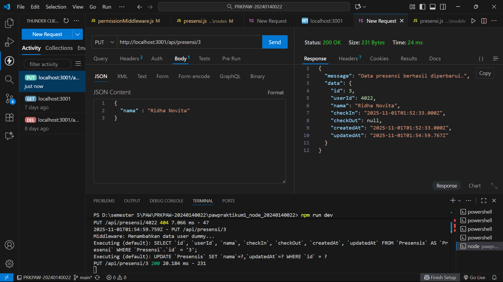
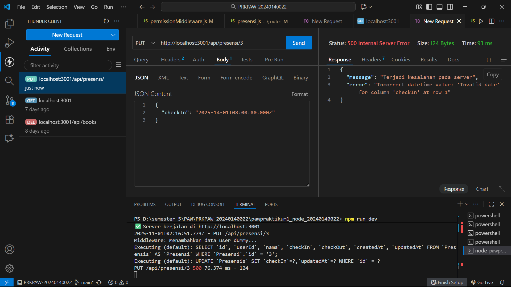
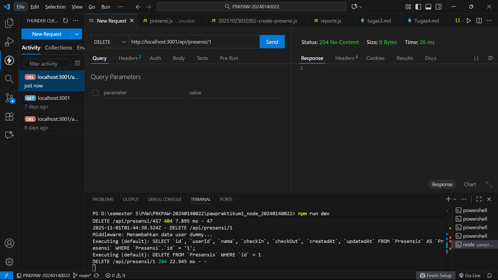
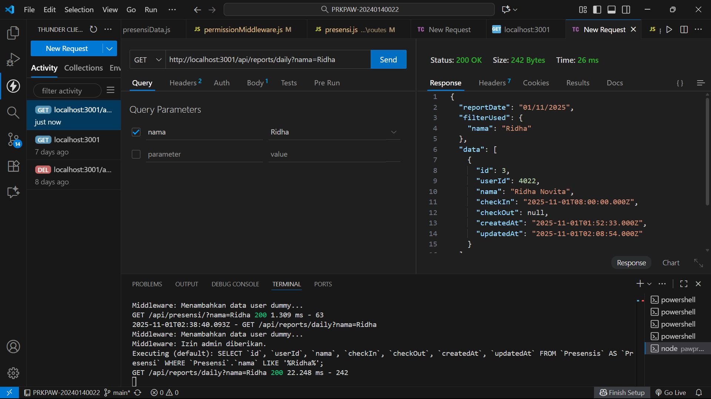
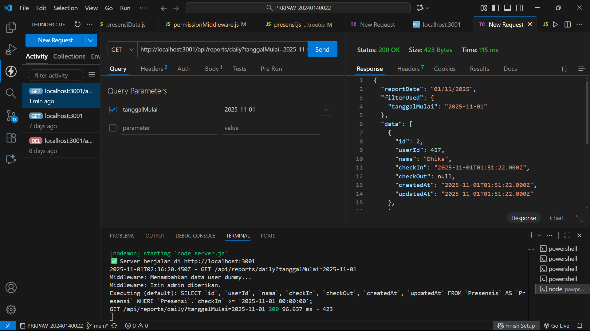

# Tugas 5

Menampilkan End Point update data presensi
 

Menampilkan End Point update format tanggal yang diisi tidak valid
 

Menampilkan End Point delete data
 

Menampilkan End Point search berdasarkan nama
 

Menampilkan End Point search berdasarkan tanggal
 