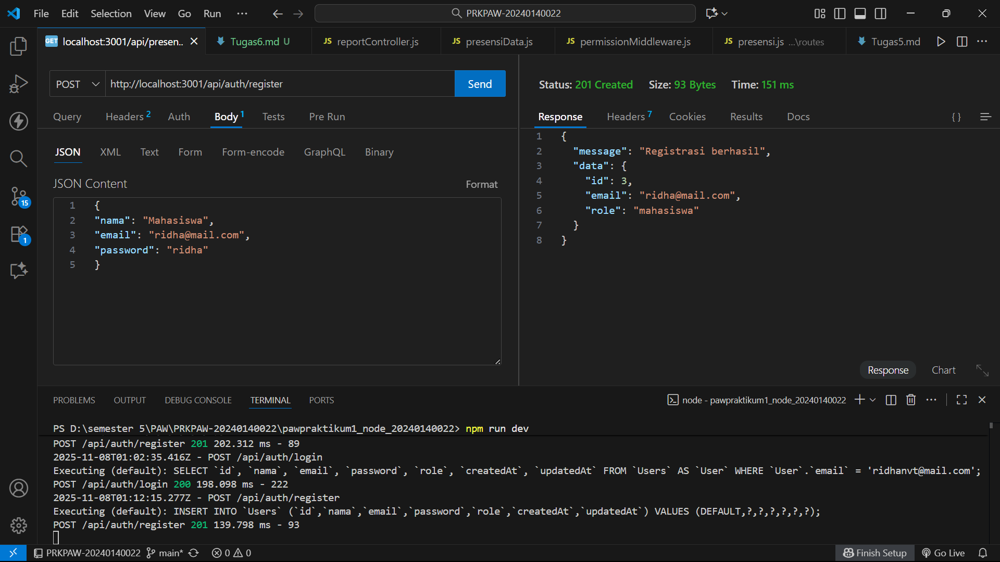
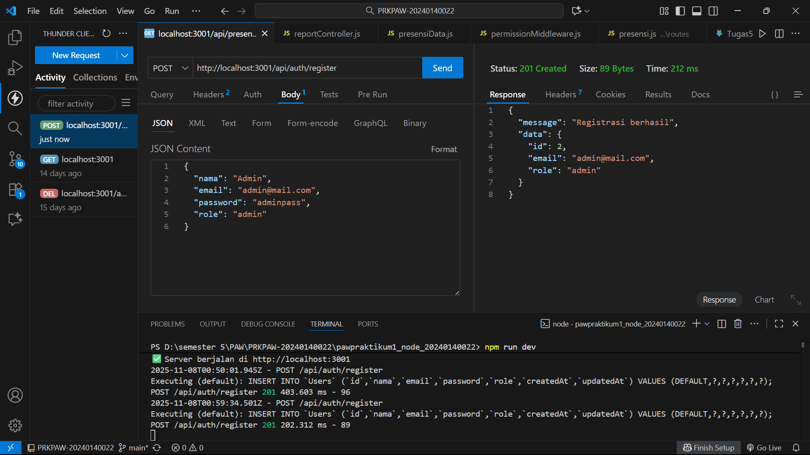
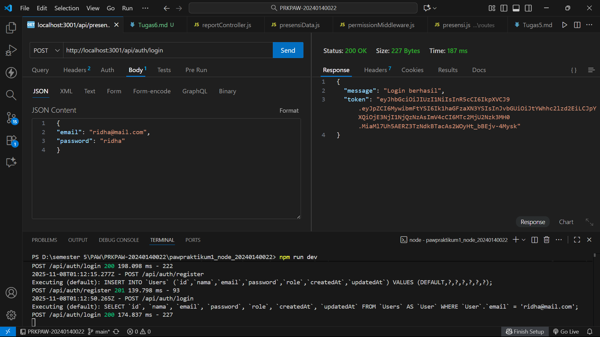
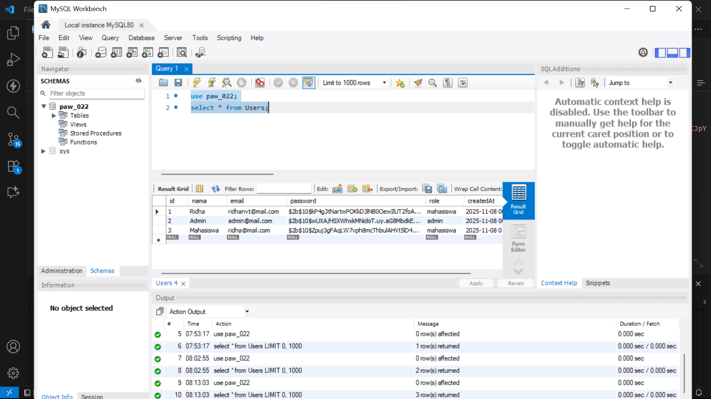

o	Request POST /register (untuk membuat user "mahasiswa")

o	Request POST /register (untuk membuat user "admin").

o	Request POST /login (login sebagai "mahasiswa" dan mendapatkan token).

o	Database table user

