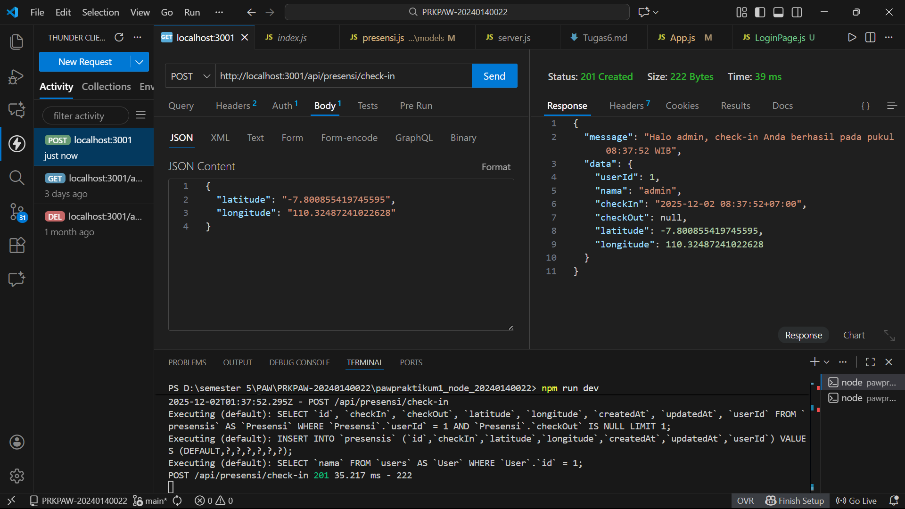
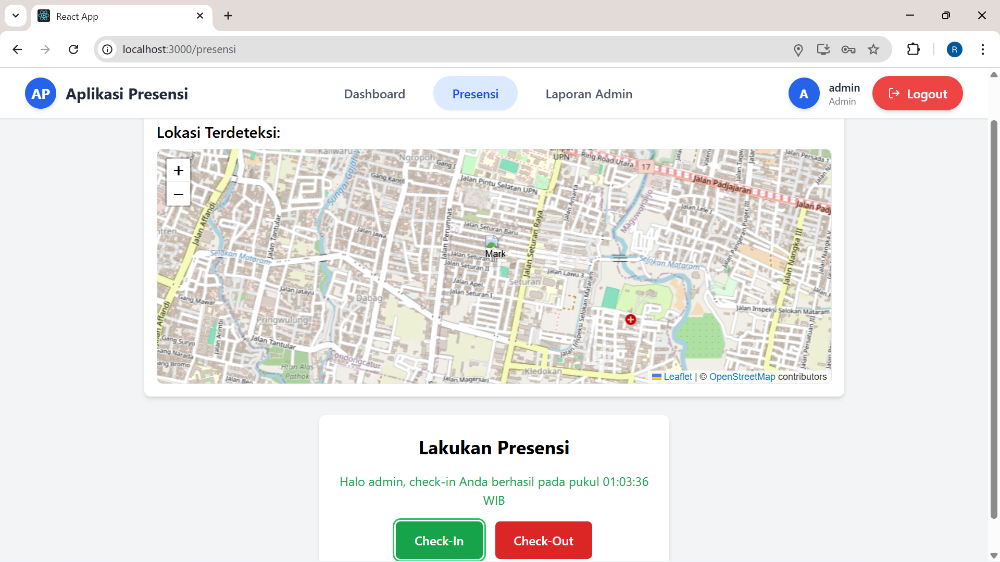
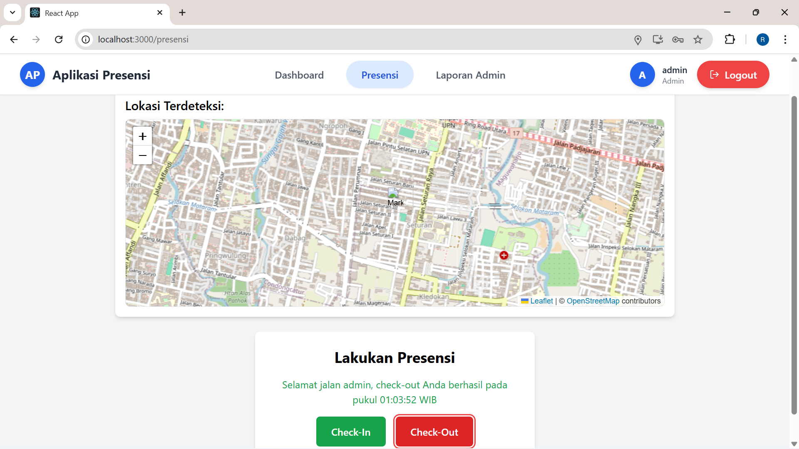
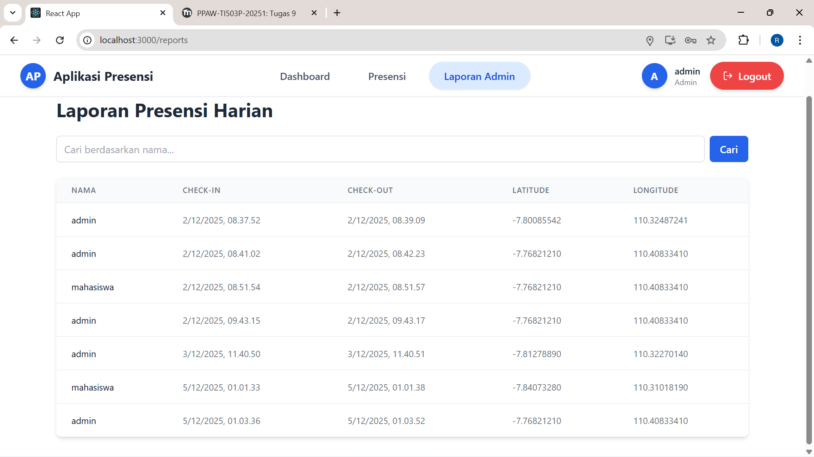
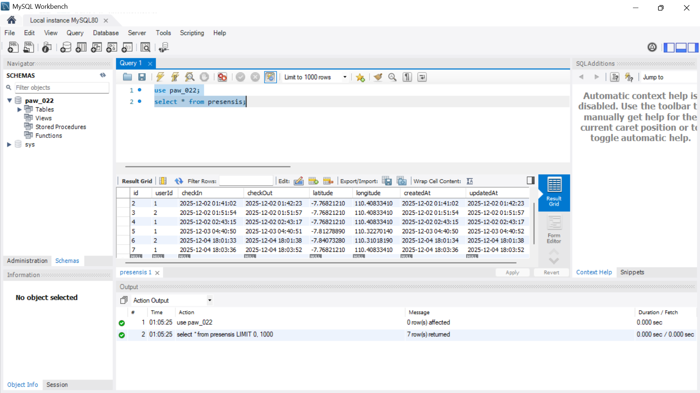

Menampilkan End Point presensi/check-in dengan bearer token dan body latitude, longtitude
 

Menampilkan halaman presensi check-in berhasil dengan menampilkan maps OSM
 

Menampilkan halaman presensi check-out berhasil dengan menampilkan maps OSM
 

Menampilkan halaman report yg berisi data presensi
  

Menampilkan screenshote tabel presensi di database
  